<p align="center">
  <a href="https://github.com/cfatrane?tab=repositories">
    
  </a>
  <a href="https://github.com/cfatrane?tab=repositories">
    
  </a>
</p>

<p align="center">
  <a href="https://git.io/streak-stats">
    
  </a>
</p>

<!--
**cfatrane/cfatrane** is a ✨ _special_ ✨ repository because its `README.md` (this file) appears on your GitHub comofile.

Here are some ideas to get you started:

- 🔭 I’m currently working on ...
- 🌱 I’m currently learning ...
- 👯 I’m looking to collaborate on ...
- 🤔 I’m looking for help with ...
- 💬 Ask me about ...
- 📫 How to reach me: ...
- 😄 Pronouns: ...
- ⚡ Fun fact: ...
-->


Hello 👋!

An alumnus of Ecole 42 with a wealth of experience spanning 6 years, I'm a Fullstack developer specializing in the design and deployment of web and mobile solutions using **React Js** , **Node Js** and **React Native**.

My career path, which spans innovative startups to large enterprises, has enabled me to develop web platforms, showcase sites, e-commerce solutions, interactive blogs and responsive mobile applications.

I work closely with my clients to understand their needs and exceed their expectations. If you're looking for a developer who combines technical expertise, attention to detail and a holistic approach to web development, I'd be delighted to discuss your project.

I'm passionate about delivering solutions that not only meet technical requirements, but also add real value for the end user. If you need an expert who can translate your visions into concrete, high-performance digital experiences, I'm at your disposal to discuss your project and contribute to its success.


<p align="center">
  <a href="https://github.com/cfatrane/monorepo-boilerplate">
    
  </a>
  <a href="https://github.com/cfatrane/nextjs-boilerplate">
    
  </a>
  <a href="https://github.com/cfatrane/your-life-in">
    
  </a>
  <a href="https://github.com/cfatrane/react-native-boilerplate">
    
  </a>
  <a href="https://github.com/cfatrane/pokedex-app">
    
  </a>
  <a href="https://github.com/cfatrane/cfatrane">
    
  </a>
</p>

<!-- ## Experiences -->

<!-- ## How to reach me 📫

<p align="center">
  <a
    href="https://twitter.com/aristoteartem"
    target="_blank"
    rel="noopener noreferrer"
  >
    
  </a>
  <a
    href="https://www.linkedin.com/in/cfatrane/"
    target="_blank"
    rel="noopener noreferrer"
  >
    
  </a>
</p> -->


<!-- Languages -->
<p align="center">
  <a href="https://skillicons.dev">
    
  </a>
</p>

<!-- Framework -->
<p align="center">
  <a href="https://skillicons.dev">
    
  </a>
</p>

<!-- Database -->
<p align="center">
  <a href="https://skillicons.dev">
    
  </a>
</p>

<!-- Group -->
<p align="center">
  <a href="https://skillicons.dev">
    
  </a>
</p>

<!-- Cloud -->
<p align="center">
  <a href="https://skillicons.dev">
    
  </a>
</p>


<p align="center">
  <a href="https://www.cfatrane.me/">
    
  </a>
  <a href="https://www.linkedin.com/in/cfatrane/">
    
  </a>
  <a href="https://twitter.com/aristoteartem">
    
  </a>
  <a href="https://www.instagram.com/aristoteartem/">
    
  </a>
  <a href="https://www.codewars.com/users/cfatrane">
    
  </a>
</p>


<!--START_SECTION:waka-->


**🐱 My GitHub Data** 

> 📦 287.9 kB Used in GitHub's Storage 
 > 
> 🏆 634 Contributions in the Year 2026
 > 
> 💼 Opted to Hire
 > 
> 📜 25 Public Repositories 
 > 
> 🔑 43 Private Repositories 
 > 
**I'm an Early 🐤** 

```text
🌞 Morning                11944 commits       █████░░░░░░░░░░░░░░░░░░░░   18.17 % 
🌆 Daytime                24957 commits       █████████░░░░░░░░░░░░░░░░   37.96 % 
🌃 Evening                24637 commits       █████████░░░░░░░░░░░░░░░░   37.47 % 
🌙 Night                  4209 commits        ██░░░░░░░░░░░░░░░░░░░░░░░   06.40 % 
```
📅 **I'm Most Productive on Thursday** 

```text
Monday                   8956 commits        ███░░░░░░░░░░░░░░░░░░░░░░   13.62 % 
Tuesday                  9432 commits        ████░░░░░░░░░░░░░░░░░░░░░   14.35 % 
Wednesday                10276 commits       ████░░░░░░░░░░░░░░░░░░░░░   15.63 % 
Thursday                 12078 commits       █████░░░░░░░░░░░░░░░░░░░░   18.37 % 
Friday                   7638 commits        ███░░░░░░░░░░░░░░░░░░░░░░   11.62 % 
Saturday                 7947 commits        ███░░░░░░░░░░░░░░░░░░░░░░   12.09 % 
Sunday                   9420 commits        ████░░░░░░░░░░░░░░░░░░░░░   14.33 % 
```


📊 **This Week I Spent My Time On** 

```text
🕑︎ Time Zone: Europe/Paris

💬 Programming Languages: 
TypeScript               14 hrs 54 mins      █████████░░░░░░░░░░░░░░░░   34.72 % 
JSON                     11 hrs 5 mins       ██████░░░░░░░░░░░░░░░░░░░   25.86 % 
Markdown                 10 hrs 1 min        ██████░░░░░░░░░░░░░░░░░░░   23.37 % 
Other                    2 hrs 57 mins       ██░░░░░░░░░░░░░░░░░░░░░░░   06.89 % 
JavaScript               1 hr 20 mins        █░░░░░░░░░░░░░░░░░░░░░░░░   03.11 % 

🔥 Editors: 
Codex Vscode             34 hrs 23 mins      ████████████████████░░░░░   80.14 % 
VS Code                  8 hrs 31 mins       █████░░░░░░░░░░░░░░░░░░░░   19.86 % 

💻 Operating System: 
Mac                      42 hrs 55 mins      █████████████████████████   100.00 % 
```

🤖 **AI Coding This Week** 

```text
⏱ AI Coding Time: 40 hrs 47 mins (95.05%)

✍️ 17,529 lines written by AI, 36 lines written by hand (99.8% AI-written)

🔤 28,838,104 Input Tokens, 3,327,714 Output Tokens

💵 $529.82 Estimated AI Cost This Week

🧠 183 AI Sessions, 498 AI Prompts

GPT                      19,784 lines        █████████████████████████   100.00 % 
Codex-Vscode             0 lines             ░░░░░░░░░░░░░░░░░░░░░░░░░   00.00 % 

🔎 AI Coding Insights:
🤖 AI-Driven — 99.8% of written lines came from AI
📄 Detailed Prompter — average 743 characters per prompt
🔁 Iterative Prompter — average 3 prompts per session
🚀 High AI Trust — 0.45% of changed lines were hand-edited
```

**I Mostly Code in TypeScript** 

```text
TypeScript               31 repos            ███████████░░░░░░░░░░░░░░   44.29 % 
C                        18 repos            ██████░░░░░░░░░░░░░░░░░░░   25.71 % 
JavaScript               11 repos            ████░░░░░░░░░░░░░░░░░░░░░   15.71 % 
HTML                     3 repos             █░░░░░░░░░░░░░░░░░░░░░░░░   04.29 % 
Python                   2 repos             █░░░░░░░░░░░░░░░░░░░░░░░░   02.86 % 
```


 Last Updated on 24/08/2026 00:17:39 UTC
<!--END_SECTION:waka-->
