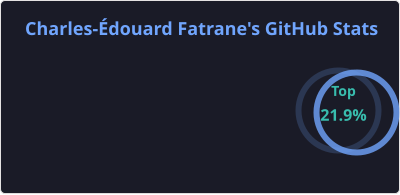
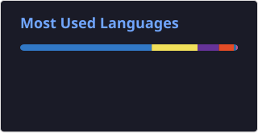
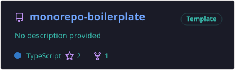
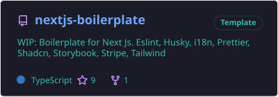
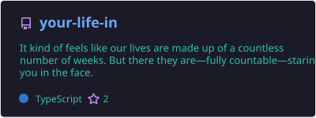
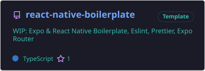
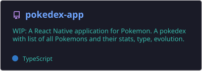
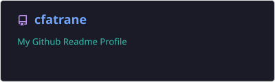

<p align="center">
  <a href="https://github.com/cfatrane?tab=repositories">
    
  </a>
  <a href="https://github.com/cfatrane?tab=repositories">
    
  </a>
</p>

<p align="center">
  <a href="https://git.io/streak-stats">
    
  </a>
</p>

<!--
**cfatrane/cfatrane** is a ✨ _special_ ✨ repository because its `README.md` (this file) appears on your GitHub comofile.

Here are some ideas to get you started:

- 🔭 I’m currently working on ...
- 🌱 I’m currently learning ...
- 👯 I’m looking to collaborate on ...
- 🤔 I’m looking for help with ...
- 💬 Ask me about ...
- 📫 How to reach me: ...
- 😄 Pronouns: ...
- ⚡ Fun fact: ...
-->


Hello 👋!

An alumnus of Ecole 42 with a wealth of experience spanning 6 years, I'm a Fullstack developer specializing in the design and deployment of web and mobile solutions using **React Js** , **Node Js** and **React Native**.

My career path, which spans innovative startups to large enterprises, has enabled me to develop web platforms, showcase sites, e-commerce solutions, interactive blogs and responsive mobile applications.

I work closely with my clients to understand their needs and exceed their expectations. If you're looking for a developer who combines technical expertise, attention to detail and a holistic approach to web development, I'd be delighted to discuss your project.

I'm passionate about delivering solutions that not only meet technical requirements, but also add real value for the end user. If you need an expert who can translate your visions into concrete, high-performance digital experiences, I'm at your disposal to discuss your project and contribute to its success.


<p align="center">
  <a href="https://github.com/cfatrane/monorepo-boilerplate">
    
  </a>
  <a href="https://github.com/cfatrane/nextjs-boilerplate">
    
  </a>
  <a href="https://github.com/cfatrane/your-life-in">
    
  </a>
  <a href="https://github.com/cfatrane/react-native-boilerplate">
    
  </a>
  <a href="https://github.com/cfatrane/pokedex-app">
    
  </a>
  <a href="https://github.com/cfatrane/cfatrane">
    
  </a>
</p>

<!-- ## Experiences -->

<!-- ## How to reach me 📫

<p align="center">
  <a
    href="https://twitter.com/aristoteartem"
    target="_blank"
    rel="noopener noreferrer"
  >
    
  </a>
  <a
    href="https://www.linkedin.com/in/cfatrane/"
    target="_blank"
    rel="noopener noreferrer"
  >
    
  </a>
</p> -->


<!-- Languages -->
<p align="center">
  <a href="https://skillicons.dev">
    
  </a>
</p>

<!-- Framework -->
<p align="center">
  <a href="https://skillicons.dev">
    
  </a>
</p>

<!-- Database -->
<p align="center">
  <a href="https://skillicons.dev">
    
  </a>
</p>

<!-- Group -->
<p align="center">
  <a href="https://skillicons.dev">
    
  </a>
</p>

<!-- Cloud -->
<p align="center">
  <a href="https://skillicons.dev">
    
  </a>
</p>


<p align="center">
  <a href="https://www.cfatrane.me/">
    
  </a>
  <a href="https://www.linkedin.com/in/cfatrane/">
    
  </a>
  <a href="https://twitter.com/aristoteartem">
    
  </a>
  <a href="https://www.instagram.com/aristoteartem/">
    
  </a>
  <a href="https://www.codewars.com/users/cfatrane">
    
  </a>
</p>


<!--START_SECTION:waka-->


**🐱 My GitHub Data** 

> 📦 290.8 kB Used in GitHub's Storage 
 > 
> 🏆 860 Contributions in the Year 2026
 > 
> 💼 Opted to Hire
 > 
> 📜 24 Public Repositories 
 > 
> 🔑 46 Private Repositories 
 > 
**I'm an Early 🐤** 

```text
🌞 Morning                4920 commits        █████░░░░░░░░░░░░░░░░░░░░   18.23 % 
🌆 Daytime                10335 commits       ██████████░░░░░░░░░░░░░░░   38.30 % 
🌃 Evening                9529 commits        █████████░░░░░░░░░░░░░░░░   35.32 % 
🌙 Night                  2198 commits        ██░░░░░░░░░░░░░░░░░░░░░░░   08.15 % 
```
📅 **I'm Most Productive on Thursday** 

```text
Monday                   3937 commits        ████░░░░░░░░░░░░░░░░░░░░░   14.59 % 
Tuesday                  4296 commits        ████░░░░░░░░░░░░░░░░░░░░░   15.92 % 
Wednesday                4144 commits        ████░░░░░░░░░░░░░░░░░░░░░   15.36 % 
Thursday                 4695 commits        ████░░░░░░░░░░░░░░░░░░░░░   17.40 % 
Friday                   3130 commits        ███░░░░░░░░░░░░░░░░░░░░░░   11.60 % 
Saturday                 3226 commits        ███░░░░░░░░░░░░░░░░░░░░░░   11.96 % 
Sunday                   3554 commits        ███░░░░░░░░░░░░░░░░░░░░░░   13.17 % 
```


📊 **This Week I Spent My Time On** 

```text
🕑︎ Time Zone: Europe/Paris

💬 Programming Languages: 
TypeScript               7 hrs 9 mins        ██████████░░░░░░░░░░░░░░░   41.27 % 
Markdown                 5 hrs 20 mins       ████████░░░░░░░░░░░░░░░░░   30.84 % 
JavaScript               1 hr 44 mins        ███░░░░░░░░░░░░░░░░░░░░░░   10.01 % 
YAML                     1 hr 18 mins        ██░░░░░░░░░░░░░░░░░░░░░░░   07.53 % 
Other                    48 mins             █░░░░░░░░░░░░░░░░░░░░░░░░   04.68 % 

🔥 Editors: 
Codex Vscode             13 hrs 57 mins      ████████████████████░░░░░   80.52 % 
VS Code                  3 hrs 22 mins       █████░░░░░░░░░░░░░░░░░░░░   19.48 % 

💻 Operating System: 
Mac                      17 hrs 20 mins      █████████████████████████   100.00 % 
```

🤖 **AI Coding This Week** 

```text
⏱ AI Coding Time: 15 hrs 44 mins (90.76%)

✍️ 1,437 lines written by AI, 53 lines written by hand (96.44% AI-written)

🔤 13,964,757 Input Tokens, 726,615 Output Tokens

💵 $224.37 Estimated AI Cost This Week

🧠 86 AI Sessions, 263 AI Prompts

GPT                      1,435 lines         ████████████████████████░   94.84 % 
Codex-Vscode             78 lines            █░░░░░░░░░░░░░░░░░░░░░░░░   05.16 % 

🔎 AI Coding Insights:
🤖 AI-Driven — 96.44% of written lines came from AI
📄 Detailed Prompter — average 815 characters per prompt
🔁 Iterative Prompter — average 3 prompts per session
🚀 High AI Trust — 4.84% of changed lines were hand-edited
```

**I Mostly Code in TypeScript** 

```text
TypeScript               33 repos            ███████████░░░░░░░░░░░░░░   45.83 % 
C                        18 repos            ██████░░░░░░░░░░░░░░░░░░░   25.00 % 
JavaScript               11 repos            ████░░░░░░░░░░░░░░░░░░░░░   15.28 % 
HTML                     3 repos             █░░░░░░░░░░░░░░░░░░░░░░░░   04.17 % 
Python                   2 repos             █░░░░░░░░░░░░░░░░░░░░░░░░   02.78 % 
```


 Last Updated on 08/10/2026 00:24:28 UTC
<!--END_SECTION:waka-->
